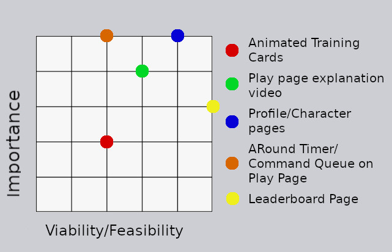

# Preface

## About the project
This project was intended to serve two purposes: To act as the basis for a personal passion project and for Milestone project 3 for Code Institute. As such, the developer tried to create a project that fulfilled two sets of requirements. This led to a ballooning of features and time involved.

### Features
Where the two personal goals (Milestone project: the database features, and the personal project: everything in the play page) meet is where the project shines. The profile page and the character page are packed with features and elements that let the user manipulate how their characters are represented to other users.

### Time, and why play.js is unfinished
The personal project aspect of the software is where things fall apart a bit. The Phaser.io canvas in the frontend represents some 600 lines of code, and the fight logic in app.py represents another 500 or so lines. This was all essentially unnecessary to the core requirements of the project, and consumed something like four weeks of development time. Upon further assessment, the developer determined that finishing the work with necessary polish would take another 2-4 weeks.

Unfortunately, the rest of the game part of the application has been shelved in the interests of time.

***

# Introduction
This is a game idea a friend and I have been kicking around since the end of Static Chaos. The core of the game will be the PvP element, with multiple classes (starting with 4 or 5), a turn-based combat system with 5 second ticks. Basic attacks are automated but players will be able to queue one or two more powerful abilities, stance changes and attacks every tick.

All code, art and game concepts are the sole original work of the developer, with the exception of the code and art credited at the end of this document. No tutorial was followed to make this game.

## Project goal
Chaos Legacy is designed to provide a fun character-building adventure with challenging fights to test their tactical thinking and character-building choices. Although finishing the adventure is outside the time-scale of this project, it should give a basic understanding of what the developer was going for.

For the developer, the project serves as a platform to learn new technologies which is why libraries like Socket.io and MaterializeCSS are being used.

Additionally,
***
## User Stories
As a user, I like:
1. Being challenged
2. Exploring a new game system
3. Exploring other characters
4. Having my own representation on the site
5. Having control over my data
***
# Development Planes
Development followed generally the concept of development planes. As shown below, development began in the third part: structure. From there, development worked backward, then forward.

## Strategy
The following categories of people might be interested in Chaos Legacy:
- New and returning player
- People interested in exploring a system

### Requirements
The application needs to:
- Give users the ability to modify their characters
- Give users the ability to use their characters
- Let users explore other characters
- Let users learn about the game mechanics
- Entertain!

### Strategy table

### Animated Training Cards (Not implemented)
The training cards as implemented have static images that represent each part or ability being trained, that changes dynamically. Optimally, those spaces would have had a simple two or three frame animation of a sprite that dynamically focused on each part being trained. 

- Importance: 2. This feature would certainly give a certain amount of "flavor" to the character page, drawing people into their character. However, there are a lot of other places to achieve that effect.

- Viability/Feasibility: 2. This feature would require the addition of an animated sprite, and would require the user to load the entire 7 megabyte Phaser script. It would also require the developer to figure out how to cleanly tie JavaScript from the canvas into behavior on the same page.

### Play Page Explanation Video (Implemented)
The Play page seems like a simple thing, but a great deal of work went into getting it together. Part of the purpose of this software is for evaluation, so a showcase of its inner workings would help shine a light on nearly 1200 lines of byzantine code.

- Importance: 4. 

- Viability/Feasibility: 3. The process would go: screenshot code, edit each screenshot, arrange them in a video, write a script, record the audio, synchronize screenshots to audio cues, upload to YouTube. It would take at least a day.

[Finished feature can be viewed here]()

### Profile/Character pages

- Importance: 4. 

- Viability/Feasibility:

### A round timer/Command Queue on Play Page

- Importance: 4. 

- Viability/Feasibility:

### Leaderboard Page

- Importance: 4. 

- Viability/Feasibility:

***
## Scope

## Skeleton

