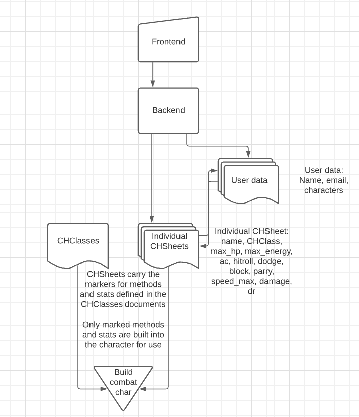
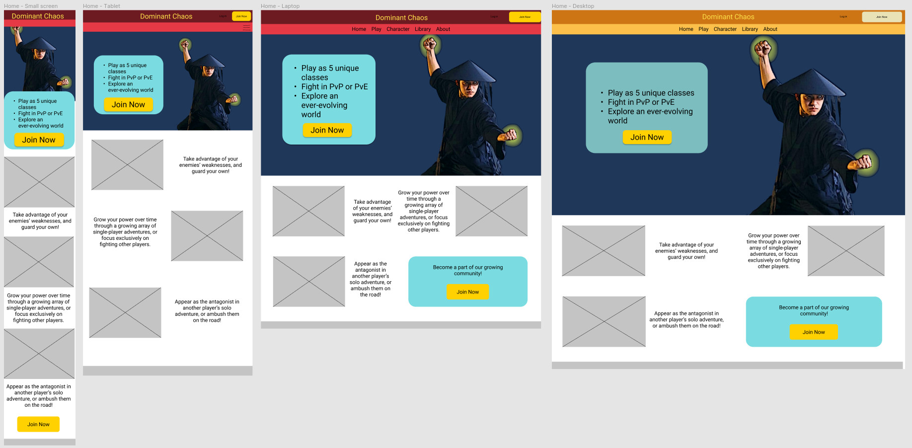
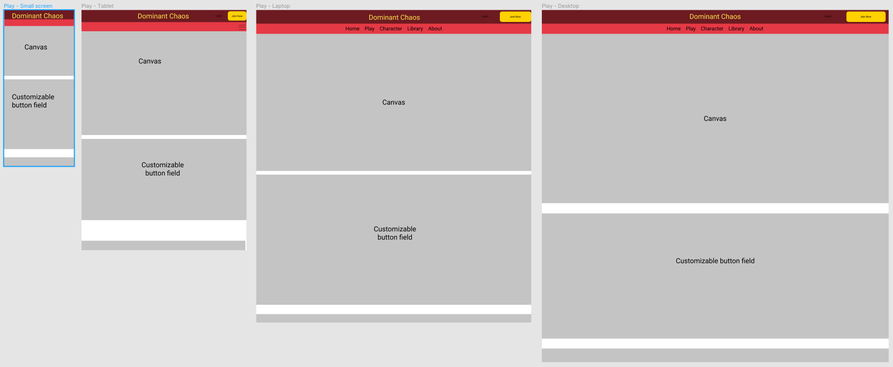
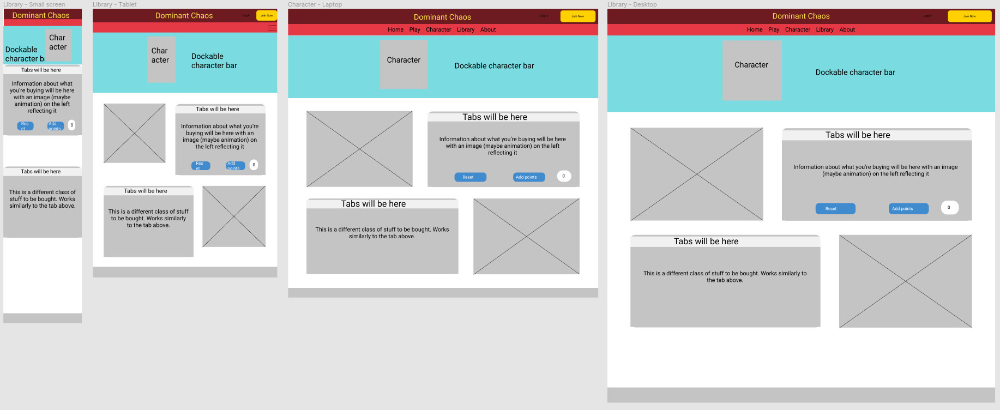

# Preface

## About the project
This project was intended to serve two purposes: To act as the basis for a personal passion project and for Milestone project 3 for Code Institute. As such, the developer tried to create a project that fulfilled two sets of requirements. This led to a ballooning of features and time involved.

### Features
Where the two personal goals (Milestone project: the database features, and the personal project: everything in the play page) meet is where the project shines. The profile page and the character page are packed with features and elements that let the user manipulate how their characters are represented to other users.

### Time, and why play.js is unfinished
The personal project aspect of the software is where things fall apart a bit. The Phaser.io canvas in the frontend represents some 600 lines of code, and the fight logic in app.py represents another 500 or so lines. This was all essentially unnecessary to the core requirements of the project, and consumed something like four weeks of development time. Upon further assessment, the developer determined that finishing the work with necessary polish would take another 2-4 weeks.

Unfortunately, the rest of the game part of the application has been shelved in the interests of time.

***

# Introduction
This is a game idea a friend and I have been kicking around since the end of Static Chaos. The core of the game will be the PvP element, with multiple classes (starting with 4 or 5), a turn-based combat system with 5 second ticks. Basic attacks are automated but players will be able to queue one or two more powerful abilities, stance changes and attacks every tick.

All code, art and game concepts are the sole original work of the developer, with the exception of the code and art credited at the end of this document. No tutorial was followed to make this game.

## Project goal
Chaos Legacy is designed to provide a fun character-building adventure with challenging fights to test their tactical thinking and character-building choices. Although finishing the adventure is outside the time-scale of this project, it should give a basic understanding of what the developer was going for.

For the developer, the project serves as a platform to learn new technologies which is why libraries like Socket.io and MaterializeCSS are being used.

Additionally,
***
## User Stories
As a user, I like:
1. Being challenged
2. Exploring a new game system
3. Exploring other characters
4. Having my own representation on the site
5. Having control over my data
***
# Development Planes
Development followed generally the concept of development planes. As shown below, development began in the third part: structure. From there, development worked backward, then forward.

## Strategy
The following categories of people might be interested in Chaos Legacy:
- New and returning player
- People interested in exploring a system

### Requirements
The application needs to:
- Give users the ability to modify their characters
- Give users the ability to use their characters
- Let users explore other characters
- Let users learn about the game mechanics
- Entertain!

### Strategy table

### Animated Training Cards (Not implemented)
The training cards as implemented have static images that represent each part or ability being trained, that changes dynamically. Optimally, those spaces would have had a simple two or three frame animation of a sprite that dynamically focused on each part being trained. 

- Importance: 2. This feature would certainly give a certain amount of "flavor" to the character page, drawing people into their character. However, there are a lot of other places to achieve that effect.

- Viability/Feasibility: 2. This feature would require the addition of an animated sprite, and would require the user to load the entire 7 megabyte Phaser script. It would also require the developer to figure out how to cleanly tie JavaScript from the canvas into behavior on the same page.

### Play Page Explanation Video (Implemented)
The Play page seems like a simple thing, but a great deal of work went into getting it together. Part of the purpose of this software is for evaluation, so a showcase of its inner workings would help shine a light on nearly 1200 lines of byzantine code.

- Importance: 4. 

- Viability/Feasibility: 3. The process would go: screenshot code, edit each screenshot, arrange them in a video, write a script, record the audio, synchronize screenshots to audio cues, upload to YouTube. It would take at least a day.

[Finished feature can be viewed here](https://youtu.be/aKTJmpi6k6Y)

### Profile/Character pages
These are essential elements of the site, and contain all of the CRUD parts. However, they could be compressed and simplified into buttons in a Phaser canvas. Pages would help tie the frontend to the backend better, and give the sense of a bigger site than just the game. They can also be far more easily styled and responsive.

- Importance: 5. This upgrade will make the site as a whole more fleshed-out and complete-feeling. It will also be far more responsive.

- Viability/Feasibility: 4. These pages will take a great deal of time.

### A round timer/Command Queue on Play Page (not implemented)
A round timer and command queue gives valuable feedback to the user as they are playing the game, giving meaning and sense to what are essential gameplay mechanics.

- Importance: 5. Without these, the gameplay will feel disjointed and confusing.

- Viability/Feasibility: 2. The process will go: Conceptualize a good representation of the round timer effect (probably some sort of notched ruler that moves at the pace of the rounds) and command queue (A list down the right of issued commands and a countdown to their eventual execution), create graphics for both, position them in the canvas, make them responsive, animate them. We might even have to tie the queue into the backend or risk getting faulty countdown timers. 

### Leaderboard Page (Implemented)
A leaderboard page would show who has the highest score in the game.

- Importance: 3. While this is not important, it would serve as the only connection between the player and the rest of the community with no multiplayer present.

- Viability/Feasibility: 5. This is an extremely attainable goal. Some JS and backend work will be necessary but not enough to scare us away from this feature.

***
## Scope

The app should have:
- The ability to manage the user's account
- The ability to manage and modify the user's characters
- A website which helps a player learn about the game
- A clear visual style
- A complete game loop
- Choices made by the player that impact how they play the game

***
## Structure
[An early prototype version of the combat logic is available here](/assets/py/fightbase.py)

This was originally intended to be kept in a separate file from the rest of the backend app. As I wrote when I moved all of the combat logic:

    "SocketIO is functioning in app.py, but fightbase.py needs to be able to route through the socket also. I found several examples of how to make this work, but it involved a total restructure of my code and heroku configuration. It would be using blueprints and total separation of code.

    Considering that the workload of this project has ballooned way larger than I had ever expected, in the interests of time I will just be moving all of the fight logic into app.py.

    It's an uglier solution than I would like, but it makes the schedule fit better."
***

[An early mockup of what the Inward Fist class should consist of is available here](/assets/py/inwardfist.py)

Once the basic combat logic was installed, this was our primary working document for the play.js logic. Much of this was successfully implemented, however:
- The combo system is partially installed. Ki can be gained to the points and the combo executed, but the actual commands in the backend are incomplete. The structure for coding each of the combo commands is in place, but the workload of finishing and polishing all of it was frankly enormous, especially considering that due to the planned length of some of the combo strikes and additional necessary animations.

- Ki is intended to start at zero and be trained from the character screen. It is still automatically at maximum for new players.

- "Tiers of aura" are a glow that should form around the character at 10, 20 and 25 ki. The animations are in the game, but play.js coding was halted before they were implemented.

- None of the disciplines do anything.

- Spritesheet 2 was never completed, but their components weren't implemented either. Most of them are related to the unimplemented combos.
***

### Play page and backend
The image above shows the bare minimum to build the game loop (apart from the elements in pink in the image above)
All core gameplay calculations are isolated from the frontend per model-view-controller theory. This way, a clever user could never modify their in-game performance. All important calculations are done exclusively in the backend and the results passed to the front.

It will require:
- Socket communication with the backend
- Extensive combat logic
- A way to parallelize the flow on the back and frontend. 

A simplified version of how the character is generated and then used to build the character that is used in play.js.
***

## The front end

### Front page:
Typical splash page. 
- Header, navbar
- hero image with small blurb and "start playing".
- Scroll down for a more elaborated version of the small blurb in the hero

***
### Play page
- Canvas with whatever graphics I can scrounge. 
- Mutable control scheme below.

***
### Character page
- Contains all training and upgrades for the character
- Contains all control scheme customization
- Maybe has a small canvas that shows the character and highlights parts when hovering over elements

### About page
- Info about meeeeeeeee

### Library page
- Contains learning materials pertinent to playing the game, and maybe information about coming updates and additions.

## dump to turn queue    

# Current Features
The actual development of the game went roughly according to the plans outlined above. I will go through the plan above and show how each part was implemented, and document the deviations. Note that these features are delved into in much more detail in the testing documentation.
***
## Features

## Features not originally planned

## Unimplemented features

# Lessons learned
## Otherwise known as "Flaws in our plan"
***
### Uniform JSON data
The whole system is built around modular functions that work dynamically with other functions so that the system can be built on infinitely. In the end, some of these functions needed complex information parsing in order to work properly. It would have been a great idea to make all data passed around in the backend one uniform package. It would mean information being passed into functions that didn't need it, but it would also mean that no parsing would be needed between multiple functions in the backend.
***
### Blueprinting
The backend could have been split between multiple files to increase readability accessibility for coding. However, since the Socket system was built into the app file, and everything accessing it was also there, it would be difficult to move it all into other files without completely rewriting huge sections of the site. The current implementation is very ugly and hard to work with.
***
### Complex, interlocking, modular, extensible code takes a very long time to write
The developer made the right call building this modularly. Most of the framework is in place that would allow a multiplayer lobby to be built and player vs. player combat to take place. (However, the socket extension is not set up to be asynchronous, so getting different socket requests from different players in order to have two separate but parallel sets of combat calculations would be the big stopping point there)

HOWEVER, the ability of the developer to guess how long some of these features would take to implement were extremely hampered by inexperience. What was intended to take two weeks of development time ballooned into 5 weeks without being finished. We had to simply stop coding it because it was set to take 2-4 more weeks by more experienced estimations.
***
### Bootstrap is awesome
In order to test the waters of other technology, and because Code Institute used it in one of its write-along lessons, the developer chose to use MaterializeCSS for the frontend.

Materialize results in stale layouts that are difficult to manipulate for complex pages. If a developer intends to go "off-book" for anything, the amount of CSS written while wrestling against Materialize is shocking.

We will never use MaterializeCSS again. Bootstrap forever.
***
### 
