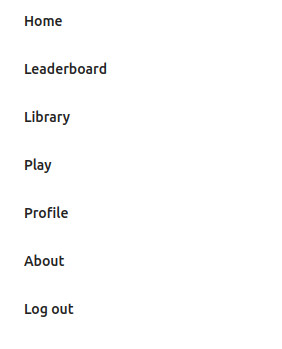
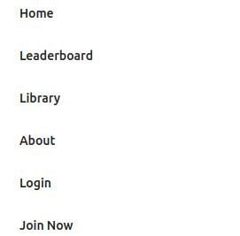
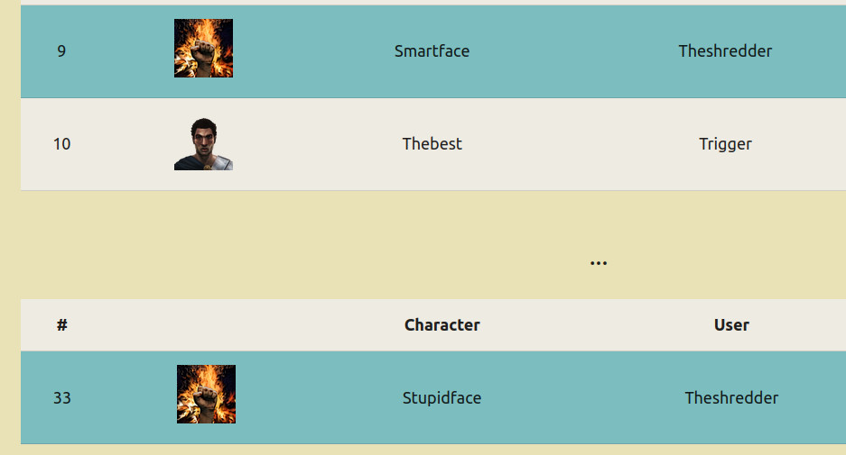
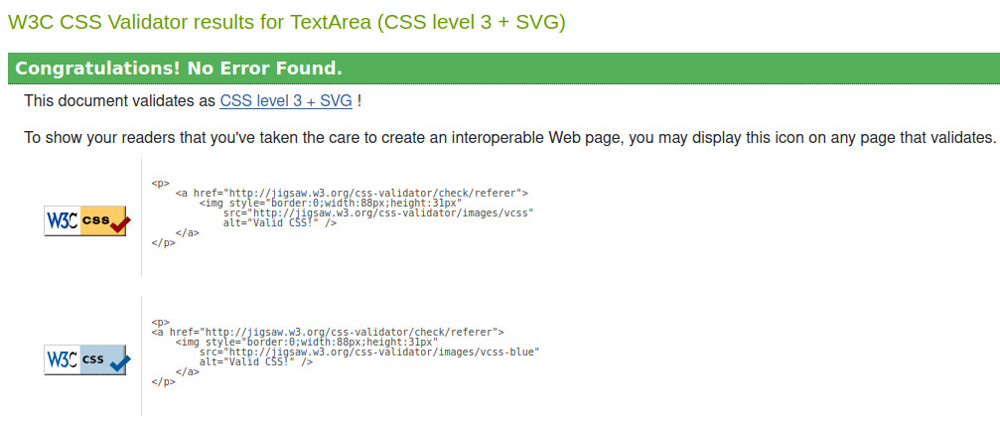

# Testing documentation

## Frontend HTML/JS testing
Cosmetically the frontend has 9 pages. Base.html contains the nav bar and the footer, as is tradition.

1. "Home," i.e. index.html.
2. Leaderboard
3. Library
4. Play
5. Profile
6. About
7. Login
8. Register
9. Character
***

### Nav bar
The nav bar consists of, essentially, three parts.

#### The top nav bar

Top nav bar contains the brand logo, login, register and logout functions. It also hosts the "hamburger" icon when the page collapses into mobile view.

All elements that require a login to use correctly are hidden to users who are not logged in. Likewise, a logged-in users will not see the register or login buttons.

- Mouseover highlights buttons
- Login and join now buttons are hidden when logged in, replaced by log out
- Login, join now, and logout buttons are moved to the mobile menu below 992 pixels
- Logo centers on screens under 992 pixels

#### The bottom nav bar
The bottom nav bar sits below the top nav bar, and has 6 navigable elements when logged in. On smaller screens, it collapses into a hamburger icon in the top nav bar.

- Pages that require a login are hidden when not logged in
- Each item accesses the correct page when clicked

#### Collapsed mobile nav
On smaller screens, all of the functionality of the navbar collapses into a hamburger icon for a sleeker site.

- Mobile menu appears when screen size is less than 993px.
- Links in mobile menu function exactly as full-size links.
- Pages that require a login are hidden when not logged in.

***

### Footer
The footer is fixed at the bottom of the page and contains three parts.

- Footer remains fixed at the bottom of the page.
- Footer takes up an appropriate portion of the page on all viewport sizes

#### Back to top button
A small floating button is generated in the footer to allow the user to easily click to return to the top of the current page.

- Back to top button returns the user view to the top of the page.
- Button remains attached to the footer throughout scrolling

#### Patreon link
The upper footer contains a link to Patreon
- Link opens page in new window

#### Copyright
The lower footer contains a message with the dev's copyright information
***

https://user-images.githubusercontent.com/78797168/131670307-8e21a552-c9fd-4453-84b9-4f54433a99a1.mp4

### "Home" page
index.html is broken up into three basic parts.

#### Hero image
The upper section is a large banner image with an offset centered call-to-action to join the site. The call-to-action has several media breakpoints to keep it in an attractive and readable state on all screens.

- Floating information box resizes appropriately on all view sizes.
- Hero image is visible on all viewports
- Button redirects to signup page.

#### Join the chaos
The middle section is a three tiered area containing general reasons a user might enjoy the site. JavaScript is used to flip the middle section upon collapsing into a single column for a uniform look.

- JS flips the order of the items so that they stack intuitively on smaller screen sizes
- All images remain visible and relevant on smaller screen sizes

#### Join the fight Today!
The final section is a smaller banner with a simple, legible call-to-action in the middle.

- Remains legible and usable on all screen sizes. Button redirects to signup page.
***

https://user-images.githubusercontent.com/78797168/131670374-838732fe-79a7-4dc1-9f90-4f35d6b021c0.mp4

### Leaderboard
The leaderboard shows the ten highest-performing fighters, organized by experience spent. If the user isn't logged in, they can still navigate to the pages of the fighters. If the user is logged in, their fighters are highlighted in a unique color. If they have a fighter that is not in the top ten, a separate but identical list shows their place. The top three fighters are gold-, silver- and bronze-colored, respectively.

- Characters not in the top 10 which are also owned by the user appear in the second list
- The second list is successfully hidden when the user owns no characters outside the top ten
- List items function as links to the character's profile
- Characters owned by the viewing user are highlighted in blue
- List collapses into a horizontal format on smaller screens
- List is viewable to logged-out users

***

https://user-images.githubusercontent.com/78797168/131670439-3b93ea8a-2a49-4c3b-8ca3-844572e9735f.mp4

### Library
The library is a simple paginated setup with information about currently implemented features and classes. Tabs are controlled by Jinja and kept in separate templates.

- Each tab opens the relevant information as expected

***

### Play
The play page is very simple, containing a link to the video on the about page, and the Phaser canvas for playing the game. The phaser canvas will be tested later in this document.

***

https://user-images.githubusercontent.com/78797168/131670449-f7eb240b-8b69-47ca-ae77-349abc8f8ed4.mp4

### Profile
The profile page is where the user is intended to control their account. Here, they can create new characters, access current characters, change email or password, and delete their account. The account deletion is contained in a pop-up modal to prevent accidental deletion. Characters are displayed in a red bar at the head of the page under the account name. The maximum number of characters is 4; with the number controlled by the lack of a "new character" button when 4 characters exist.
***

https://user-images.githubusercontent.com/78797168/131670482-4e3f70ad-32f0-468d-8aea-f02e81beb5e1.mp4

### About
The about page contains some general information about the software, the development team, and a video detailing the complexities of the Phaser canvas and backend games.
***

### Character
The character page is the most complex page next to the play page, weighing in at over 200 lines of JavaScript and 300 lines of html.

It is broken up into four sections:

#### Stats
The stats section contains 10 stats relevant to that character. They are broken up into two sections that stack responsively with each other on smaller screens. Each has its own pop-up tooltip viewable on mouseover.

#### Bio, winrate and icon
The character bio is a scrollable viewing window for the user-entered biography.

The character icon display shows the user-chosen icon. If the character's owner is logged in, a tab underneath the icon expands upon clicking, allowing the user to select a new icon. The icon chosen is updated and changed without refreshing.

Winrate is a simple display of how many matches have been won and lost by the character.

#### Training
Training is split into two sections, each with a textual element and an image representing the tab current accessed in the other element. These two sections allow the user to train various stats relevant to the in-game characteristics of their character, and is reflected in the stat block above.

Extensive JavaScript control moderates what the user sees and does in these windows:
1. Prevents training above the maximum
2. Allows training many levels at once.
3. Shows the cost of each point and the total cost of training.
4. Changes the visible tab when a tab name is clicked on.
5. Changes the associated image to reflect what is being trained.

#### Edit bio and delete character
Edit bio is a simple DB call.

Delete character is hidden behind a button: clicking the delete button opens an in-line dialogue box asking the user to type their character's name, warning them that it is irreversible.
***

### Log in and register
These are separate but equal pages, containing a card with fields for inputting information. Relevant password and email fields have light validation, and the username field will only accept letters and numbers.
***

# Automated testing

## W3C HTML validator

[W3C Markup Validator](https://validator.w3.org/)

All pages were checked by URI (except profile, which was checked by manual text entry) and all errors highlighted have been corrected.

### Flash heading

One highlighted warning was not corrected, as shown above. This is the "flash" area of all pages except Play, which has no heading because it is empty when not in use.

## CSS validator
[W3C CSS Validator](https://jigsaw.w3.org/css-validator/validator)

### Variables in style.css
The CSS validator threw a lot of warnings about the use of variables to control the color scheme. The variables seem to work as intended and the developer has decided not to change them.

## JS Validator
[JShint](https://jshint.com/)

All errors found in JS were corrected, except those outlined below.

### Warnings, explained:
    "Functions declared within loops referencing an outer scoped variable may lead to confusing semantics. (bodyTraining, i, bodyString, calculateCost)"
This warning appears in a few places. These parts are some of the best-commented parts of the code, which should help alleviate any concerns of semantic confusion.
***

    'let' is available in ES6 (use 'esversion: 6') or Mozilla JS extensions (use moz).
and 

    'template literal syntax' is only available in ES6 (use 'esversion: 6').
If the user is using Phaser, they also have ES6.
***

    "Undefined variables"
These are common when working with a Phaser canvas. Because best practice in Phaser is to isolate code, often a global variable is called in one file and then used in another. In short, this is not a relevant note.
***

In play.js, line 409:

    eval can be harmful.

eval() can be harmful if used with untested or submitted information. However, in this context it is pulling from a list generated by the code in the database. The software has complete control over the code being evaluated.

## PEP8 compliance
[PEP8 Online](http://pep8online.com/)

All PEP8 compliance errors resolved.

Developer's note: There were over 400 errors, resulting in 80 new lines of code and 500 changes. Developer was NOT using comments correctly.
